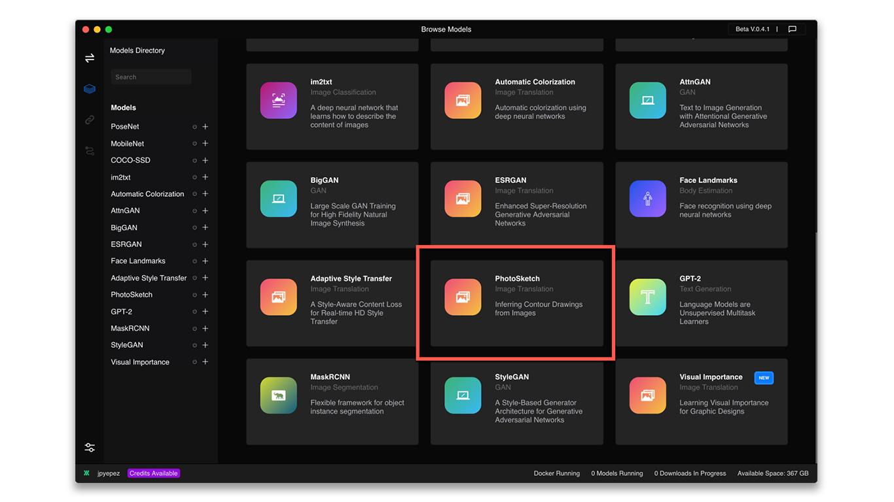
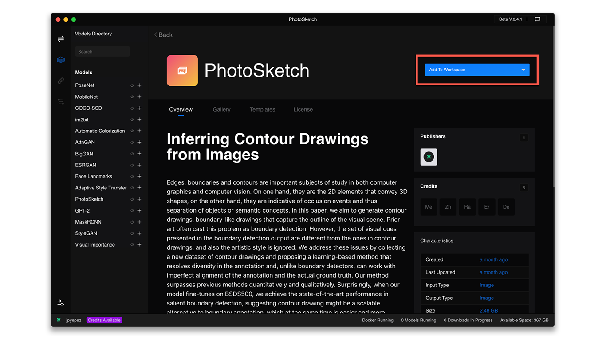
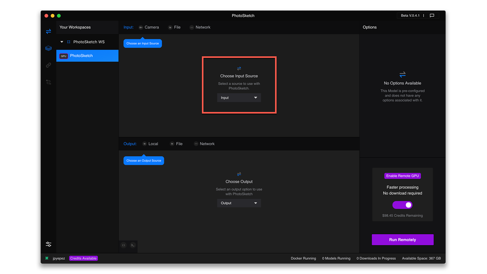
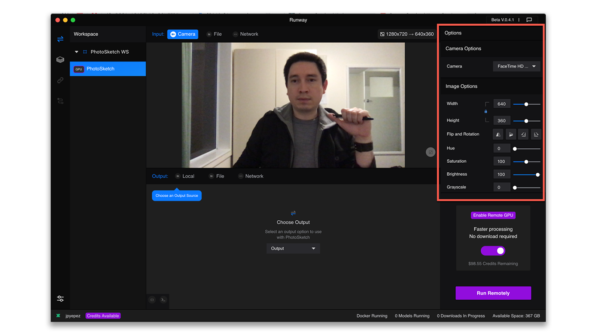

# Tutorial: Creating Contour Drawings with PhotoSketch

The [PhotoSketch model](https://arxiv.org/pdf/1901.00542.pdf) created by Li et al. allows you to infer contour drawings from images automatically.
In this tutorial, we will use Runway to run PhotoSketch to create a real-time contour outline of your webcam stream. We will then send the resulting image via HTTP network to a simple web app built with JavaScript and [p5.js](http://p5js.org/)

## Requirements
* Runway Beta
* Optional: Docker to run the model locally. (To install Docker, please follow the installation instructions [here](https://docs.runwayapp.ai/#/installation?id=download-docker))
* A webcam or built-in camera

## Step 1

Select the **PhotoSketch** model from the Model Directory.

## Step 2

Add the model to a workspace using the drop-down list on the top right
side of the app.

## Step 3

Select **Input** > **Camera**

## Step 4

Set the camera and image options.

## Step 5

Select **Output** > **Network**, and click on **HTTP**.
Use the HTTP server and route to send the resulting image to an external app.

Choose to run it locally or remotely on an external GPU. You can enable the remote GPU by toggling the  **Enable Remote GPU** switch on. Next, click on **Run Remotely**.

## Step 6

In the external app, make sure Runway's server and routes match to receive the output as a base 64 image.

## Summary

In this tutorial, we used the PhotoSketch model to generate live contour drawings from your webcam stream and use those as inputs to draw on a web app.
